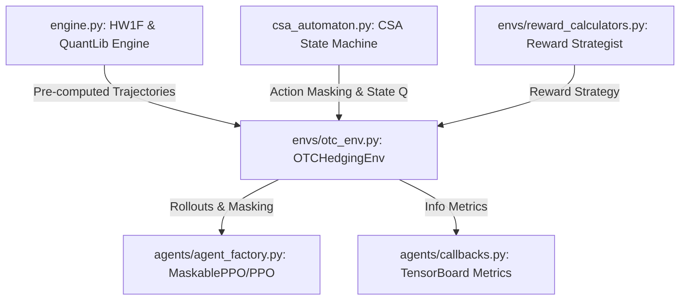

# Automaton-Informed Reinforcement Learning (AIRL) for OTC Derivatives

AIRL is a modular, high-throughput reinforcement learning framework designed to jointly optimize market risk hedging (front-office) and variation margin liquidity management (back-office) for Over-the-Counter (OTC) derivatives. 

The framework enforces 100% legal compliance to ISDA/CSA covenants by coupling continuous market dynamics with a legal Finite State Machine (FSM). The FSM dynamically masks illegal actions during reinforcement learning rollouts, guiding the agent to optimize economics without risking default.

---

## 📖 The Big Picture & Financial Context

In derivative trading desks:
* **Front Office (Hedging):** Focuses on executing trades to flatten market risk (minimizing Delta/Vega exposure).
* **Back Office (Collateral):** Posts Variation/Initial Margin dictated by Credit Support Annex (CSA) agreements. If an institution fails to fund a margin call within the contractually mandated timeline (e.g., $T+2$), it triggers a catastrophic **Event of Default**.

### The AIRL Solution
Instead of relying on heavy negative penalties that the agent must learn through trial-and-error (which leads to catastrophic defaults during training), AIRL feeds the agent a **Cross-Product State Space ($S \times Q$)**:
* **$S$ (Continuous Market State):** Simulated yield curves, swap valuations (Mark-to-Market), and exposure profiles.
* **$Q$ (Discrete Legal State):** The current status of the CSA contract (e.g., Normal, Margin Call Issued, Grace Period, Default).

We utilize **Invalid Action Masking** (via `MaskablePPO`) to zero out the probabilities of illegal decisions (e.g., ignoring a margin call on the final day of the grace period) before policy updates. This forces the agent to learn to proactively smooth liquidity cushions to prevent ever entering critical legal states.

---

## 🏗️ System Architecture & Modularity

The codebase is decoupled using a **Strategy Pattern** to ensure components are swappable:



### Component Details
1. **Stochastic Simulator (`engine.py`)**: Implements a vectorized Hull-White 1-Factor (HW1F) short-rate simulator and QuantLib re-pricing engine. Trajectories are pre-calculated during environment resets to ensure maximum rollout throughput.
2. **CSA Automaton FSM (`csa_automaton.py` & `simple_automaton.json`)**: A state machine driven by a JSON configuration mapping legal covenants (`normal` $\rightarrow$ `margin_call_issued` $\rightarrow$ `grace_period` $\rightarrow$ `default`).
3. **Gymnasium Environment (`envs/otc_env.py`)**: Standard Gym interface returning the combined state $(S, Q)$ and the action masks.
4. **Reward Strategist (`envs/reward_calculators.py`)**: Abstract strategist supplying multi-objective rewards (`JointOptimizationReward`, `PureHedgingReward`, `PureLiquidityReward`).
5. **Agent Factory (`agents/agent_factory.py`)**: Factory method initializing MaskablePPO (with `ActionMasker`) or baseline PPO.
6. **Observability Callbacks (`agents/callbacks.py`)**: TensorBoard rollout callbacks tracking peak liquidity deficits, unhedged risk, rule violation attempts, and FSM state occupancies.

---

## 🚀 Getting Started

### Prerequisites
* Python 3.8+

### Installation
1. Clone the repository:
   ```bash
   git clone https://github.com/shreyashnadage/RL_AUTOMATA.git
   cd RL_AUTOMATA
   ```
2. Create a virtual environment and activate it:
   ```bash
   python -m venv venv
   # On Windows:
   .\venv\Scripts\activate
   # On macOS/Linux:
   source venv/bin/activate
   ```
3. Upgrade pip and install dependencies:
   ```bash
   python -m pip install --upgrade pip
   pip install -r requirements.txt
   ```

---

## 🧪 Verification & Testing

The repository includes a comprehensive unit testing suite to verify pricing precision, shape compliance, and masking logic.

Run the test suite using `pytest`:
```bash
pytest -v -s
```

### Tests Covered
* **`test_engine.py`**:
  * Mathematical sanity checking of swap Mark-to-Market (MtM is ~0 at $t=0$ par initialization).
  * Shape and dimensions of generated trajectory batch matrices.
  * Non-negativity constraints on exposure profiles.
  * Performance profiling (pre-pricing batch evaluates in $<0.15$ seconds).
* **`tests/test_masking.py`**:
  * Action masking correctness (blocks "Ignore Margin" when in `grace_period`).
  * Gymnasium API compliance diagnostics using SB3's official `check_env`.
  * Rollout safety run executing agent initialization and rollout callback metrics logging.
