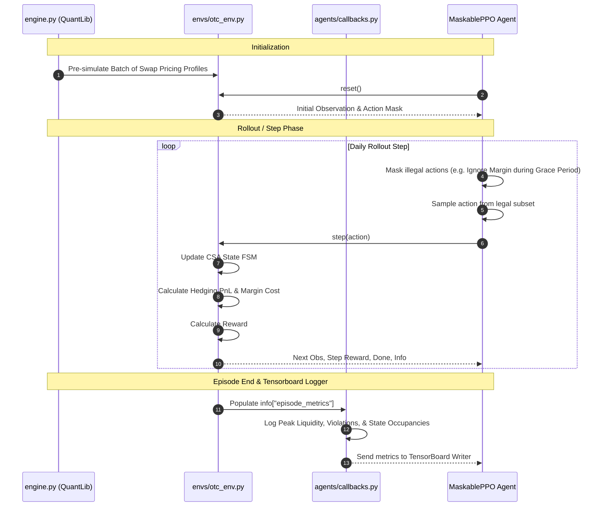

# RL Training and TensorBoard Monitoring Guide

This guide explains how to run the Reinforcement Learning (RL) training process, how the training loop and agent are structured under the hood, and how to monitor the training runs using TensorBoard.

---

## 1. Running the Training Process

To run the RL agent training, you can use the command-line utility [train.py](file:///d:/RL_AUTOMATA/train.py) located in the repository root.

### Training Command
Run training with default options (MaskablePPO, 50k timesteps, Joint Optimization reward):
```bash
python train.py
```

### Customizing Training Parameters
You can adjust training behaviors via command-line arguments:
```bash
python train.py --algo MaskablePPO --timesteps 100000 --reward joint --paths 200 --days 30
```

#### Available Arguments:
*   `--algo`: The RL algorithm choice (`MaskablePPO` [recommended] or `PPO`).
*   `--timesteps`: The total number of environment steps to train (default: `50000`).
*   `--reward`: The reward strategy (`joint`, `hedging`, or `liquidity`).
*   `--tb_log_dir`: The destination folder for TensorBoard logs (default: `./logs/tb/`).
*   `--paths`: The size of the pre-simulated market trajectory batch (default: `100`).
*   `--days`: Duration of a trading episode (default: `30` days).

---

## 2. Monitoring with TensorBoard

AIRL logs standard RL parameters alongside custom financial and legal metrics during rollouts.

### Starting TensorBoard
Open a new terminal window in your project directory (with the virtual environment activated) and run:
```bash
tensorboard --logdir=./logs/tb/
```

Once running, navigate to `http://localhost:6006` in your browser.

### Key Metrics to Monitor
Under the **Time Series** tab, look for the following custom metric namespaces:

#### 1. `financial/*`
*   `financial/mean_peak_liquidity`: Tracks the maximum liquidity deficit incurred by the agent during rollouts. A decreasing curve demonstrates that the agent is learning to manage cash and avoid large margin shortfalls.
*   `financial/rule_violations`: Tracks how often the agent tries to select illegal actions (e.g., ignoring a margin call during a grace period). For `MaskablePPO`, this will remain close to `0` since illegal actions are masked out before step selection.
*   `financial/mean_unhedged_risk`: Measure of the total unhedged Mark-to-Market (MtM) movement experienced by the portfolio. A lower value indicates a highly effective hedging strategy.

#### 2. `automaton/*`
*   `automaton/state_occupancy_<state>`: Tracks the fraction of time spent in each FSM state (`normal`, `margin_call_issued`, `grace_period`, `default`). Successful agents will minimize the time spent in `grace_period` and completely avoid `default`.

#### 3. `rollout/*` and `train/*`
*   `rollout/ep_rew_mean`: The rolling average of episode rewards (should increase as training progresses).
*   `train/loss`: The policy and value loss curves from PPO.

---

## 3. RL Agent & Training Loop Architecture

The training loop leverages Stable-Baselines3 (SB3) and the SB3-Contrib library to support invalid action masking.



### Breakdown of the Loop:
1.  **Environment Setup**: When the rollout starts, the environment uses `SyntheticSwapEngine` to pre-generate a batch of short-rate path trajectories and their corresponding swap valuations.
2.  **Environment Reset**: On `env.reset()`, the environment selects a random path from the batch, resets the cash balance to the initial value, and initializes the legal state to `normal`.
3.  **Invalid Action Masking**:
    *   If running `MaskablePPO`, the policy uses the wrapper `ActionMasker` to query `env.action_masks()` at every step.
    *   The logits corresponding to illegal actions (such as ignoring margin calls when in a `grace_period`) are set to $-\infty$ so their probability becomes zero.
4.  **Step Execution**:
    *   The agent takes a step.
    *   The environment executes the action, updates the FSM state, updates the cash balance (based on hedging PnL and margin payments), and computes the step reward.
5.  **Metrics Hook**: When an episode ends (`terminated` or `truncated`), the environment packages statistics (peak liquidity deficits, rules breached, state occupancy counts) into the `info` dictionary. The `FinancialMetricsCallback` catches this metadata and logs it directly to TensorBoard.
